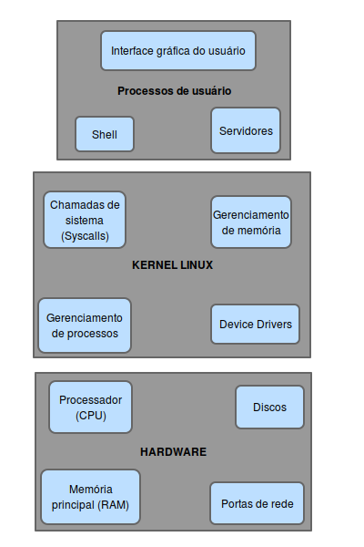

***LEMBRAR DE DIVIDIR EM EXPLICAÇÃO LONGA E EXPLICAÇÃO CURTA, NO INICIO DE TODA EXPLICAÇÃO, FAZ-SE UMA EXPLICAÇÃO CURTA, APÓS ISSO UMA DETALHADA.***

# Linux

Para explicar como funciona o linux, o ideal e usarmos da abstração. Iremos dividir o linux em componentes:

- HARDWARE
- KERNEL DO LINUX
- PROCESSOS DE USUÁRIO

# Kernel
O kernel é responsável pelo gereniamento de 4 grandes áreas:
- Processos: quem usa a CPU, quando, como.
- Memória: qual parte deve ser alocada, qual parte compartilhada, que parte está livre
- Device Drivers: Atua como interface entre o hardware e os processos.
- Chamadas de sistemas (system calls OR syscalls) e suporte: processos normalmente usam cahamda de sistema para se comunicar com o kernel.

## Gerenciamento de processos:
 -> O ato de um processo passar o controle da CPU para outro processo chama-se *alternância de contexto*(context switch).

Cada porção de tempo chama-se de *time slice*(o processo normalmente termina sua tafera atual em uma única fatia de tempo)

Como cada processo executa em *time slice* curtos a percepção humana, nos dá uma falsa ideia de multitarefa(*multitasking*)

<montar figura da pg 21, do 1 ao 7>

Kernel é executado entre os *times slices* dos processos, durante a alternancia de contexto.

OBS: no caso de várias CPUs o processo é diferente.(ler pg 21)

## Gerenciamento de memória:

A tarefa dele é ardua, e deve seguir as seguintes condições:

- O kerdel deve ter sua própria área privada na memória, a qual os processos de usuário não deverão ter acesso.
- Cada processo de usuário deve ter sua própria seção de memória.
- Um processo de usuário não poderá ter acesso à memórias privadas de outro processo.
- Os processos de usuário podem compartilhar memória.
- Partes da memória do processo de usuário podem ser somento para leitura.
- O sistema pode user mais memória do que está físicamente presente ao usar o espaço em disco como auxiliar (partição swap)

Felizmente o kernel é ajudado pela MMU(Memory Management Unit) que permite acesso à **memória virtual**(ultilizando tableas de página).

## Chamadas de sistema e surpote.

Todo processo de usuário no linux começa com o `fork()` e depois um `exec()`. Um exemplo simples é que ao usar um comando no shell (tipo ls, du...) ele cria um fork do shell e depois exec(ls). (syscall consistem em uma interação entre um processo e o kernel)

O kernel também suporte chamadas de pesoudodiveces(se parecem com dispositivos, porem são implementações em software). Por isso não precisão está no kernel, estando só por razões práticas. Exemplo: `/dev/random`(dispositivo gerador de número aleatório.)

# Espaço de usuário:
